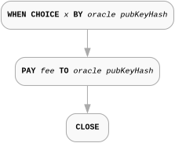
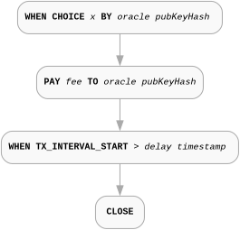
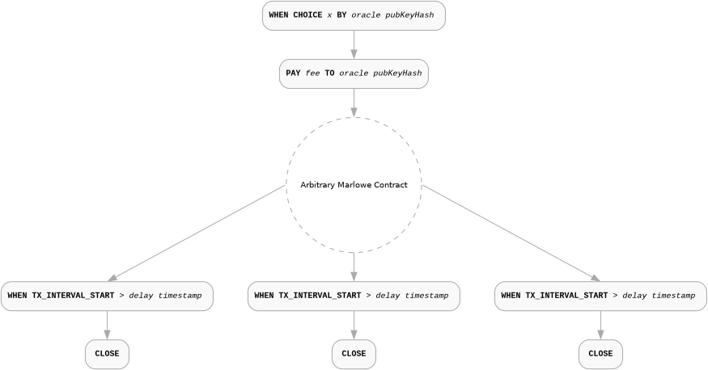
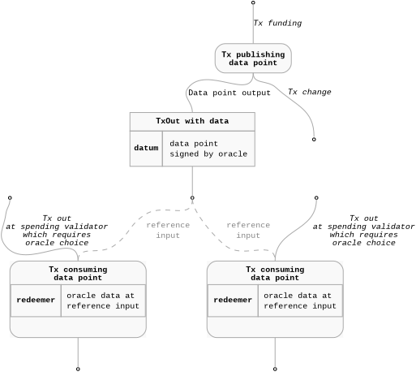
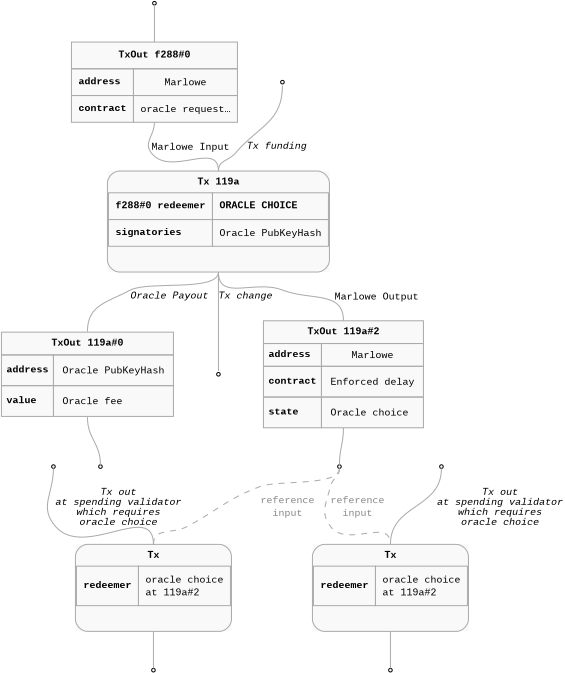
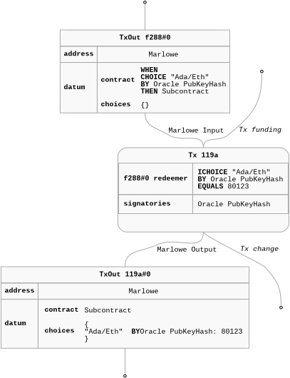
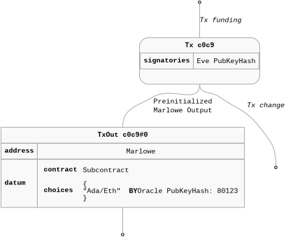
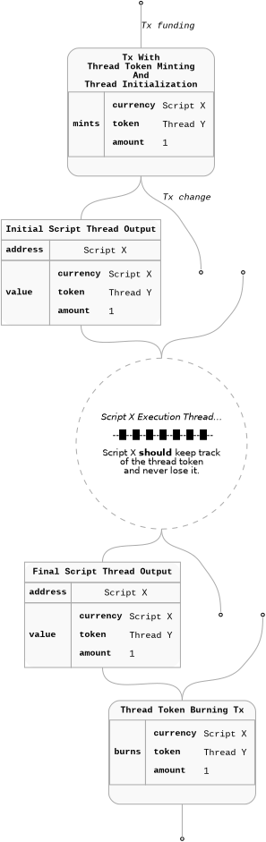
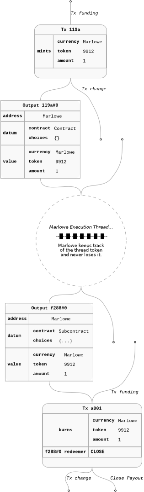

## Abstract

Smart contracts running on Cardano require access to external data of various kinds from Oracle providers: exchange rates between crypto- and fiat currencies; “real world” data, such as weather information; information of significance for betting and gaming apps, including details of play from sporting events; and, not least, reliable and secure sources of randomness. Current Cardano Oracles primarily push a fixed repertoire of data on-chain, critically limiting their ability to provide the range and depth of data outlined above. 

This CIP describes a more flexible, transparent and composable oracle solution for Cardano, based on the Marlowe smart contract language, using the `Choice` construct in Marlowe to deliver the oracle value within a running smart contract, as well as making that value available to other Cardano other smart contacts, whether written in Marlowe, Aiken, Plutus or other languages.

## Motivation: why is this CIP necessary?	

External data is used within the vast majority of smart contracts running on blockchain, and provision of this data by oracle providers is essential to these contracts running effectively and securely. The “push” model of data provides an ~80:20 solution: 80% of needs are satisfied by a limited set of data feeds, particularly those based on DeFi information of various kinds; it is, however, unable to service the “long tail” of potential demands for data of a more specialized kind, and to do this in practice a “pull” model of data provision is required.

The mechanism outlined delivers data through the `Choice` construct in the Marlowe smart contract language. Executing an instance of this construct in a running contract delivers an external integer value that can be directly accessed within the contact, and also be made available for use by other smart contracts on Cardano. 

For this approach to work in practice, this CIP needs to address the following high-level questions:

* How to identify what data is requested, and from which source, including an access mechanism for the source.  
* How results of oracle requests are rendered for use within Marlowe.  
* How results are made available on-chain to other Cardano smart contracts, including information about the data source, format and rendering.  
* How the results of particular instances of data requests are identified, both within and outside running Marlowe contracts.  
* The security model assumed by the oracle protocol.

These high-level questions are answered in the next section, together with a discussion of implementation-related issues such as timeouts and error handling, and potential extensions of the protocol, such as access mechanisms.

## Specification

This section described the Marlowe Oracle Protocol in detail. Assumptions made in the description are listed here, before the specification itself.

### Assumptions

* No distinction is made between the data source and the oracle provider. In future versions of this protocol, this distinction may be possible.  
* IPFS is used as a standard for content-addressable off-chain data here; other equivalent mechanisms may be used.  
* We take a pragmatic approach to trust, assuming that users of the system are able to identify trustworthy oracles for themselves.

The Marlowe Oracle protocol is based on using the choice mechanism in Marlowe, by which choices “external” to a contract are made available to the contract. The Marlowe construct that handles external actions is `When`, which selects between a number of `Case`s. Each `Case` is triggered by an `Action`: in this case the `Choice` action. On that action happening, the continuation contract is initiated; if no action is made before the timeout, the fallback contract is initiated: we assume that in this case it is `Close`, which closes contract operation, refunding any funds in the contract to the participants. The relevant Marlowe syntax constructs are (eliding irrelevant constructors):

`data Contract = … | When [Case] Timeout Contract | …`  
`data Case     = Case Action Contract`  
`data Action   = … | Choice ChoiceId [Bound] | …`

Choices are identified by a `ChoiceId`, which combines a `ChoiceName` – a `ByteString` – with a `Party` to the contract. On forming the action, a set of `Bound`s are given that constrain the `Integer` value to be chosen.

`data ChoiceId   = ChoiceId ChoiceName Party`  
`type ChoiceName = ByteString`  
`data Bound      = Bound Integer Integer`

The `ChoiceId` construct is used to describe an oracle value: 

* The `Party` is `PubKey pkh`, where `pkh` is the hash of a public key for the oracle that is the source of the data.  
* The `ChoiceName` ByteString is used to identify the data requested, and the specific request itself. We discuss this in detail now.

The `ChoiceName` byte string is used to describe a collection of data: 

| layout | data\_source | API | data\_query | query\_result | resolution | … |
| :---: | :---: | :---: | :---: | :---: | :---: | :---: |

* The first 32 bytes describe the **layout** of the remainder of the byte string, namely its length, and the names and lengths of the remaining fields.   
* Any fields may be present, but the fields **data\_source**, **API**, **data\_query**, **query\_result** and **resolution** must be included.

A running example, based on oracle data from Wolfram Blockchain Labs, as documented [here](https://docs-ccdb.waexservices.com/), is used to illustrate the remainder of the description.

The **data_source** should be the root URL for the oracle service whose public key is in the `Party` component of the `ChoiceId` of which this `ChoiceName` is the other component.

In the running example of services provided by Wolfram Blockchain Labs this field would be https://access.ccdb.waexservices.com.

The **API** should point to a description of the API for the data provider. This can take a number of forms, including.

* The root URL for the web page which can reliably and safely translate a given \`data\_query\` (which could be a hash or machine readable version of the query) to a human readable form.
* The root URL for the API documentation for the interface for the data provider. In the running example this would be https://docs-ccdb.waexservices.com.
* In the case that there is no published interface, an anchor that points to a file in IPFS containing a sufficient description to understand the particular data\_query, query\_result and resolution for this particular choice.

The **data\_query** should contain a query to the data\_source that conforms to the API. 

* In the case of the running example this will be a URL making a GET request to the endpoint for the service, defined according to the standard in the API.
* Instead of a query, the field may contain the anchor for an IPFS file containing the query.  
* The query encoding can be also encoded using a custom format not suitable for human consumption which should be resolved and explained by the API.

The **result** should contain an anchor for an IPFS file that contains the result of the query, and a description of how an Integer is extracted from the result, which is called the *resolution* of the query. 

* In the case of the running example, results are returned in JSON format, and the resolution will typically involve:
  * Selecting a field or fields  
  * Converting those fields to numbers  
  * Aggregating those numbers into a single Integer.

The **resolution** should contain an Integer, constructed according to the description in the **result**.

### Data Availability

We will first present a minimal Marlowe contract request structure first. Then we will try to iterate to make it safely useful in the context of cross-script data sharing. We will then move to the security aspect of the data sharing. At the end we present the specifics of the datum and the contract state encoding which should be used by the external on-chain data consumers.
Some elements of this scheme require slight extensions to the current Marlowe validator (but not the Language) and its tooling. We will indicate those elements in the spec.

When we consider an on-chain data consumer - any smart contract - we should emphasis one critical aspect of information sharing on Cardano. Validators can only access a subset of the UTxO set during validation. This subset should be provided to the transaction as regular inputs or reference inputs - we will preset more details below in the [Execution Thread](#execution-thread) section. Smart contracts can not inspect any historical already consumed outputs or transactions. In order to provide some historical data to the smart contracts these data or some verifiable proofs of that history have to be present somewhere in the UTxO set and included in a transaction which requires it for validation. Usually those kind of informations are encoded through some specific tokens or datums.

#### Marlowe Oracle Request

##### Minimal Marlowe Request

As already discussed a minimal protocol request consists of two constructs a `Choice` and a `Payout`. This structure provides oracle harvester ability to easily detect requests on the chain together with a guarantee of the reward payment.

  

Marlowe validator enforces a "removal" of the contract thread UTxO together with the state and choices from the UTxO set when a contract reaches its execution end. What we really mean by "removal" here is not any historical data deletion because block chain is immutable ledgers by nature but rather a removal of the UTxO from the set of unspend inputs and not outputting a corresponding "continuation" output which would preserve the Marlowe contract state.

From that perspective the n its own this contract structure is not a reliable from the other on-chain data consumers point of view.


For example if we consider the minimal contract from the first section's diagram above the data point will disappear from the accessible UTxO set together with transaction in which it is provided. We just reach the `Close` step together with the `Choice` and `Pay` in the same on-chain transaction - `Pay` and `Close` are evaluated "eagerly" after the `Choice` suspension point (they are not suspension points on themselves).

##### Marlowe Oracle Request with Enforced Delay

Marlowe provides ways to enforce a delay of the contract execution in a predictable way. The ability to suspend contract can be used to provide guarantees for the consumers that the contract state will be present on the chain for a certain amount of time.

  

We propose to use this extra separate step as a basis of a reliable data sharing protocol. This step can follow a `Choice` and `Pay` steps directly or be used as some future step in the contract following them. What is important is that the delay is unconditionally present on all the following execution paths. An important detail is that all possible timeouts present int the contract are adjusted accordingly. The one which relates to the oracle `Choice` step should be appropriately distanced from the final delay so the overall interval during which the data are available on the chain is fully specified. Additionally all the timeouts in the following contract which precede the delay step should be larger then the its expected deadline.

  

#### UTxO Level Publishing

##### Reference Inputs And Oracle Data Sharing

Cardano provides a way to "use" UTxO in a transaction without consuming it. It is enough to add such a UTxO to the reference input set of a transaction. Through this mechanism cross smart contract communication and data sharing is possible. It does not involve direct interaction with the smart contract which possibly sits at the referenced UTxO level (the UTxO can be also a regular address based one) - this script is not executed when an input is referenced. On the other hand validators involved in the transaction which references a particular input can inspect it - read its datum, value or check the output address without consuming the other contract input.

This mechanism is used by existing oracle provides on Cardano and enables access to a published data point. Data points are usually approved using an oracle signature under a data point structure and this tuple is included in a UTxO.

> **FIXME**: check/consult this point with the Cardno oracles protocols.

  

As discussed previously data point is visible on  chain as long as the UTxO is not consumed. There seem to be no standard cross oracle standard regarding those aspects of the protocols. Signed data points provide a bit more flexibility as they separate publisher from the data provider and possibly can be republish by anybody on the chain.
Of course the described publishing strategy on its own does not directly provide a way to enforce payment in exchange for the access to the information. In many cases publishing is driven by an up front payment through off-chain channels and is specific to the oracle provider. Some oracles also publish some data for free rather regularly.

##### Marlowe Based Data Publishing

Let's look at the UTxO level overview of the Marlowe data publishing process. Marlowe extends the above flow with a preliminary data point request and subsequent reward payout for the oracle. It can optionally include enforced delay on the contract level to also become a data feed for some other consumers.



At the end the data are provided to the consumers through the datum in similar fashion to the publishing feeds but they won't include any extra signature so authenticity of the data has to be proven using some other means which we discuss below.


##### Cross-Marlowe Choice Sharing

> **FIXME**: Should we drop this section and move it to a separate MIP and discussion page? Should we link this separate discussion from there?

In the current version of the Marlowe validator it is impossible to use choice value from the other instance of Marlowe. We could imagine that on the validator level choice value is read from another Marlowe contract UTxOs as described above but in such a case the choice name which is used to identify that choice should uniquely identify the query in a cross-contract fashion. This is exactly the nature of oracle choices described in this document.
It seems that in order to properly implement such a feature we should introduce to the language itself a notion of a `ChoiceId` which is "globally" unique. To do so we probably have to introduce `ChoiceName` to the language:


```haskell
data ChoiceName = LocalChoiceName String | GloballyUniqueChoiceName String
data ChoiceId = ChoiceId ChoiceName Party
```

##### Authenticity Of The Data

###### Forging Marlowe Choice

On the UTxO level Marlowe validator ensures that the transaction which delivers the choice value was signed by a key corresponding to the party from the contract. After that step every Marlowe thread UTxO protects and keeps that choice together with the party information and value in a map in the datum.

  

Even though Marlowe validator manages that information carefully so it is copied from the inputs to the transaction outputs we can not really be sure that the original information was actually verified in the first place. On the Cardano blockchain it is possible to create an arbitrary output. Malicious actor Eve could easily fake previously presented output just by publishing a transaction with precisely crafted output:

  

The above scheme is possible because the transaction which Eve constructed does not involve Marlowe validator execution at all! Additionally the choice itself which is stored in the datum is not paired with the data provider signature so she can actually create an arbitrary data point and pair it with arbitrary `Party` (represented by public key hash in our case).

###### Execution Thread

Marlowe uses rather basic and standard pattern for sequential execution of smart contract on the EUTxO (Extened UTxO) based block chain. In this approach smart contract can be modelled by a state machine which resides on a UTxO. Machine transitions happen when the output is consumed. State itself is kept on the UTxO level in the dataum and asset level and the action input(s) to the machine is provided through the redeemer. Below diagram presents this concept in more details:

  

When spending validator is executed it checks if a given action(s) is executed correctly by inspecting the transaction and checking if it fulfils a particular transition conditions (signature checking for a given step, token presence etc.). Crucially in this context it verifies that the continuing output is present and it contains the same script address, expected value and datum with state of the machine representing result of a given action(s).


###### Thread Token

In order to fix the above problem we could significantly change the validator and require an extra signature to be provided and stored together with the data point.

> **FIXME** - should this optional comment:
>
> There is a MIP which proposes introduction of "Signed Choices" but even with this extension we don't plan to store the actual signatures in the Marlowe state. The authenticity of the value will be again implied by the execution itself.

Another option is to introduce a data verification step execution proof. If we could prove that the choice which is stored in the contract state was actually verified by Marlowe validator in some previous transaction then any consumer could trust the data without checking the transaction history which is impossible to perform on-chain. In order to do so we can use the concept of a `thread token` coupled together with preconditions checking.

Cardano ledger guarantees that tokens of a specific asset class can be minted only by a script which hashes to that asset class value. In other words token existence is a proof that a specific script was successfully executed in some past transaction. Thanks to [CIP-0069](https://github.com/cardano-foundation/CIPs/tree/master/CIP-0069) we can use a single script to validate minting and spending which is really convenient - we can have a single script and token identifier which when present together on a UTxO can indicate a valid thread of execution. The essence of the thread token pattern flow is captured in the diagram below:

  

The final scheme consists of three properties of the script which implements it:

* The script should allow minting a single unique token only if it is outputted to a UTxO where spending validator has the same hash as its own.

* The script when validating spending should check if the token of its own currency is passed to the output which contains the same spending validator.

* Additionally the script should allow burning on both spending and minting levels when there is no continuing execution thread output.


##### Thread Token as a Proof Of Marlowe Execution

The pattern described above when introduced to the current Marlowe validator together with an additional precondition checking could be a basis for a reliable data authenticity verification scheme. The precondition which should be check during the initial minting in this case is that the initial choice map in the Marlowe state is empty. Given this initial check we can imply that:

* Marlowe token is only present at a UTxO if the initial precondition was checked because Marlowe never leaks the thread token, burns it at the end and performs the actual check during minting.

* Given some choice in the Marlowe state at the Marlowe UTxO which contains the thread token we can be sure that the choice verification step was executed because the initial state was checked and was empty.

  

> **TODO**: Clean up transaction headers and `CLOSE` redeemer - could be be `INotify` assuming the last step is just a delay.

Please note that we can ignore the exact thread identifier - it can be useful in some context but the scheme allows us to trust choices stored in the Marlowe state relying on a single Marlowe validator hash which should be reflected on the spending validator level and the thread token as well.
Additionally this trust scheme is Marlowe contract agnostic really. It can be used outside of the Marlowe Oracle Protocol context!

##### Marlowe Datum Encoding

> **TODO**

## Rationale: how does this CIP achieve its goals?	

The rationale fleshes out the specification by describing what motivated the design and what led to particular design decisions. It should describe alternate designs considered and related work. The rationale should provide evidence of consensus within the community and discuss significant objections or concerns raised during the discussion.

It must also explain how the proposal affects the backward compatibility of existing solutions when applicable. If the proposal responds to a CPS, the 'Rationale' section should explain how it addresses the CPS and answer any questions that the CPS poses for potential solutions.

> **TODO**

## Path to Active	

Organised in two sub-sections (see Path to Active for detail):

* Acceptance Criteria  
  Describes what are the acceptance criteria whereby a proposal becomes 'Active'.  
* Implementation Plan  
  Either a plan to meet those criteria or N/A if not applicable.

> **TODO**

## Optional Sections	

May appear in any order, or with custom titles, at author and editor discretion:

* Versioning: if Versioning is not addressed in Specification  
* References  
* Appendices  
* Acknowledgements

> **TODO**

## Copyright	

The CIP must be explicitly licensed under acceptable copyright terms (see below).

> **TODO**

