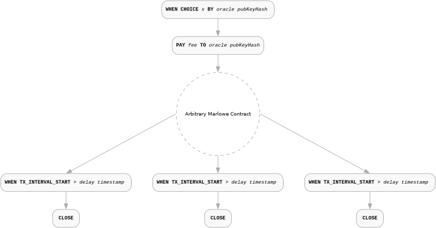
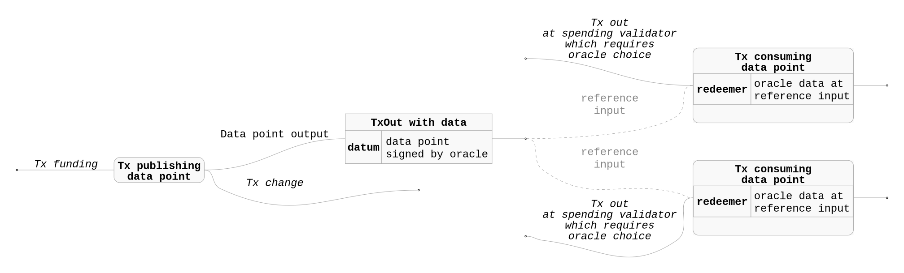
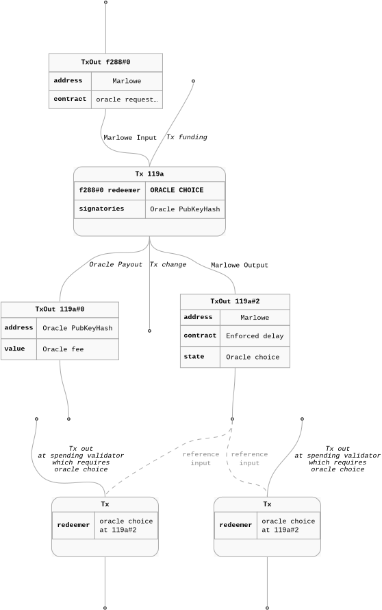
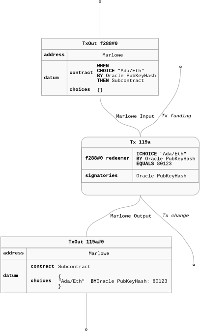
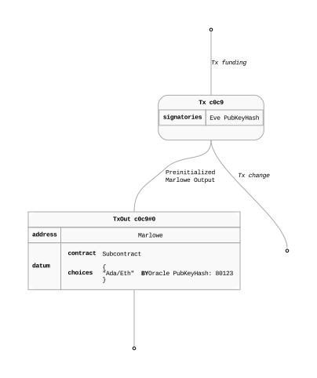
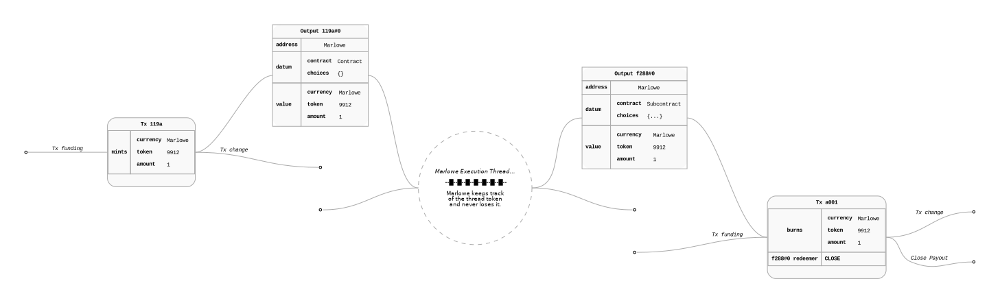

### Diagrams

#### Marlowe

* Minimal Marlowe request - this request can not be really used by the other smart contracts. Data disappears from the chain in the same transaction when it is provided.

  

* Marlowe request with enforced delay - by introducing the delay we have a guarantee that the data will be present on the chain for a particular amount of time.

  

* Marlowe contract with a request - in this case we have a contract which could be useful on its own and implement some internal cash flows based on the oracle data and also we make the data point available for the other smart contracts.

  

#### UTxO Level Publishing

* UTxO data publishing and usage through reference inputs.
  
  

* UTxO level overview of the Marlowe data publishing. This scheme extends the above with the preliminary data point request with subsequent guaranteed fee payout and with visible enforced delay on the contract level to make the data available.
  
  
  
  TODO:
    * Cleanup the data point usage script and redeemer - unify it with the above diagram?
    * Make the Tx headers human friendly - drop the tx ids etc.
    * Drop tx funding utxos?

#### Authenticity Of The Data

* On the UTxO level Marlowe validator ensure that the transaction which delivered the data was signed by appropriate signing key. After that step what is really accesible on the chain by the other contracts is the final UTxO.
  
  

* On the UTxO it is possible to create an arbitrary output. Malicious actor Eve could fake previously presented output because the choice itself which is stored in the state is not signed by the oracle so she can actually "provide" an arbitrary data point.
  
  

* Cardano ledger guarantees that tokens of a specific asset class value can be minted only by a script which hash equals to that class value. In other words token existence is a proof that a specific script was successfully executed. We can use this property and extend Marlowe validator so it can be used for preliminary minting - the minting policy will check if the choices map is initially empty.
  Marlowe spending validator will take care of the token so it never leaks the "execution thread" meaning that it is passed to the transaction output which is a continuation output of the Marlowe contract or it is burned if there is no continuation output.
  Given those assumptions we can conclude that tokens of "Marlowe asset class" will be only present as part of the correct Marlowe execution thread.
  

## How results are made available on-chain to other Cardano smart contracts, including information about the data source, format and rendering.

### Reference Inputs And Oracle Data Sharing

* Cardano provides a way to reference UTxO without consuming by including it in reference inputs set of the transaction. Through this mechanism cross smart contract communication and data sharing is possible.

* Referenced inputs are part of the transaction which can be inspected by the transaction validators. Smart contract can inspect referenced UTxO - read its datum, value or check the output address without consuming the other contract input.

* This mechanism is used by existing oracle provides on Cardano and enables access to a published data point. Data points are usually approved directly using an oracle signature under a data point structure.

* The published value can be accessed up until the oracle UTxO is consumed. Accessibility of the value can be critical to dependent on it contracts and this aspect can be resolved on the extra layer of logic possibly implemented by validator which resides on a specific UTxO. There seem to be no standard which is respected across different oracles which can be used for that aspect.

* The publishing strategy does not directly provide a way to enforce payment in exchange for the access to the information. In many cases publishing is driven by an off-chain protocols and payments specific to an oracle.

### Marlowe Oracle Request And Data Availability

* In the case of Marlowe the oracle data point is delivered as a part of Marlowe contract. That specific request can be of course part of a larger Marlowe contract which requests more data points (from different oracles) or even uses that information in its internal logic to drive the cash flows.

* Marlowe provides ways to enforce suspension of the contract execution in a predictable way. The ability to delay contract can be used to provide guarantees that the contract state information will be present on the chain for a certain amount of time.

* Our proposal can Marlowe stores choices and possibly derived values in the state of the contract which is kept in the datum.

* Internally Marlowe itself can express more complex oracle(s) interactions (multi-response averaging, `n of m` checks etc.) to fulfil a specific contract's needs but even in such cases the original oracle choices are present in the state of the contract.

In this spec we describe basic data point sharing which is Marlowe contract logic agnostic. This scheme gives opportunity to use the oracle data in other contracts in a fully trustless way.
Some elements of this scheme require slight extensions to the Marlowe validator and it's tooling. We will indicate those elements in the spec.

### Trustless data sharing

* Marlowe does not support signed data requests in the current version. This protocol version proposes to use standard Marlowe approach to data authenticity verification. Marlowe checks signature under the transaction which delivers a particular choice.

* Marlowe provide a way to authorize a steps like choice using token witness scheme but usage of that approach is outside of the scope of this spec.

* When a choice is delivered Marlowe keeps it in the map which associates particular public key and choice name with the value. This piece of data can be easily accessed by other contracts.

* Because the data themselves are not signed, other contracts can not directly verify the authenticity of the data.

* As mentioned above Marlowe validator performs verification on its own but UTxO at validator address with correct datum is not a proper proof of execution.

On the other hand during proper can be used as already validated if we can prove that the validation step was actually performed.
It is possible to artificially create arbitrary UTxO on the chain

More advanced data sharing with specific 

`data ChoiceId   = ChoiceId ChoiceName Party`  

## How the results of particular instances of data requests are identified, both within and outside running Marlowe contracts.

## The security model assumed by the oracle protocol.

Brainstorm:

* Marlowe is an interpreted language on the chain. Given a Marlowe contract with some state and assets plus the Marlowe interpreter, it is safe to assume (Plutus implmentation of the interpreter was audited) that the Marlowe contract will be executed as specified by the language semantics and the state and assets will be updated correctly.

* On the chain the above elements are tight to a UTxO:
  * address should point to an official Marlowe interpreter script,
  * datum should contain Marlowe contract and state
  * assets locked in the UTxO should be the assets used in the Marlowe contract (plus minimum ADA).

* Marlowe is expressed using different formats:
  * On the blockchain level the `Contract` and the state by necessity is represented as Plutus core `data` values (https://plutus.cardano.intersectmbo.org/resources/plutus-core-spec.pdf # section 4.3.1.1).
  * On the cross language API level and tooling level we use `Json` or `Yaml` interchangeably. We try to keep that format human readable and easy to use.
  * There is a Haskell derived DSL syntax which is used in some tools (e.g. Marlowe Playground) and in specs. We don't want to discard this case because we expect that this format will be replaced by a proper language in the future versions.

* We provide a set of tools and APIs which translate those formats. The `data` format is the lowest level format and the precise spec for it

* Beside the lower level spec of the format we will provide for TypeScript and Haskell reference implementations:
  * decoders into a JSON format of the Datum
  * libraries which will provide functions which allow indentification of possible oracle requests (Idea: maybe on chain we should require at least some prefix before the hash that suggest that a given choice is possibly an oracle request.)

## Marlowe Plutus `data` Encoding

